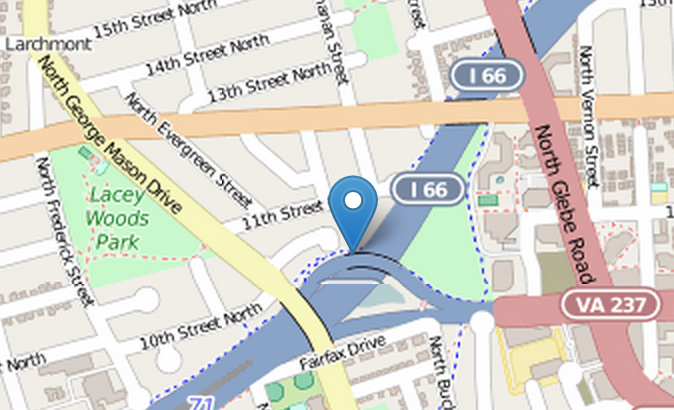
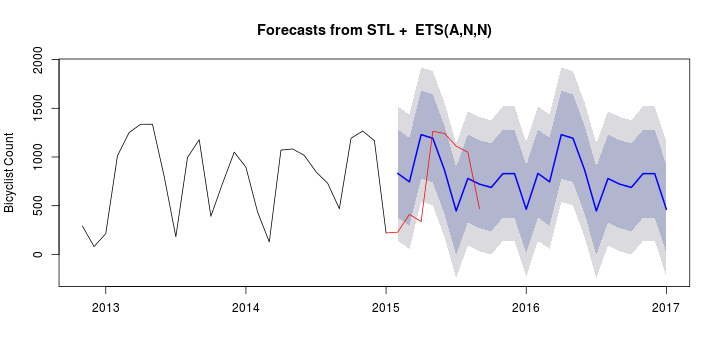

---
title       : Bicycle Forecasting in Arlington, Virginia
subtitle    : Peering into the future of local bike trails
author      : Brian Frickert
job         : Senior Data Over-Engineer
framework   : io2012        # {io2012, html5slides, shower, dzslides, ...}
highlighter : highlight.js  # {highlight.js, prettify, highlight}
hitheme     : tomorrow      # 
widgets     : []            # {mathjax, quiz, bootstrap}
mode        : selfcontained # {standalone, draft}
knit        : slidify::knit2slides

---{
 tpl: thankyou
}


## What Urban Planning questions can measuring Bike Trail Usage answer?

  * Are bike trails currently being utilized?
  * Will they be utilized more or less in the future?
  * Do we even need cars in Arlington County?
  
  > * (yes, depends, and absolutely)

---{
 tpl: thankyou
}

## My Revolutionary Trail Usage Forecaster!



My **fabtabulous** Bike Trail Forecaster not only shows you **WHERE** 
a county bike sensor is, it also shows each month's count of bicyclists
on that trail! What's more: it looks deep into the FUTURE, forecasting
how many bicyclists will use the trail in the months to come!!

---{
 tpl: thankyou
}

## BEHOLD THE FUTURE of the Custis Rosslyn Bike Trail!


    

```r
    fcast <- forecast(fit, method="ets")
    plot(fcast, ylab="Bicyclist Count")
    lines(test, col='red')
```

 

---{
 tpl: thankyou
}

## Is the Forecaster always accurate?

Not exactly.

This is the average of percentage errors when evaluating the forecast with the 2015 sensor readings 
or Mean Absolute Percentage Errors (MAPE). For this trail, my forecast is off, on average, by almost 100%.


```
## [1] 98.45818
```

My suspicion is that the forecast will improve as more data is collected.

--- {
 tpl: thankyou,
 social: [{title: gplus, href: "http://plus.google.com"}, {title: twitter, href: "http://twitter.com"}]
}

## Thank You

For more information you can contact.
